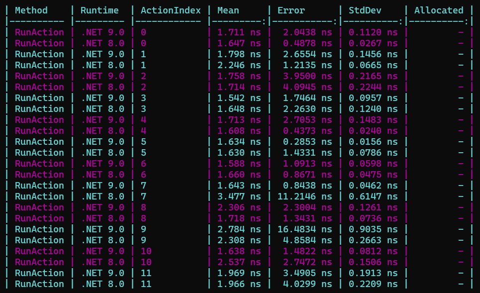

## Generic parameterised with Nullable\<T> benchmarks
This repo contains benchmarks for "Performance Testing Extension for Unity Test Runner" and "BenchmarkDotNet", which compares values in generic classes with null.

It was motivated by the fact that "Unity 2022.3.21f1" may box value types in generic classes when comparing with null.

Maybe I'll try it with the Unity 6 and the latest Unity 2023 version in the future.
2022.3.21f1 was chosen because now I'm currently working on a project that uses it.

## Build
```bash
# This will run the script that will build the library with benchmarks
# and copy the .dll to the Unity project Plugins directory
dotnet fsi .\BuildCommonLib.fsx
# Unity project asmdef already has link to this dll in the "precompiledReferences" section
```

## Run
### Unity
Unity benchmarks can be run via "Window -> General -> Test Runner" window.\
You can see the results in the "Window -> General -> Performance Test Report" window.
#### Or
```shell
# The result will be placed in ./Results/Unity.xml
Unity -runTests -batchmode -forgetProjectPath -projectPath ./UnityProject/ -testResults ../Results/Unity.xml
```
### BenchmarkDotNet
```shell
dotnet run ./BenchmarkSuite --framework net9.0 -c Release -- --job short
```
```shell
# Or you can specify runtimes
# Project that defines benchmark should also has there frameworks as targets.
# (It's also why you should specify '--framework')
dotnet run ./BenchmarkSuite --framework net 9.0 -c Release -- --job short --runtimes net8.0
# (It'll run both 8 and 9)
```

## Results
### .NET 8.0 .NET 9.0 (in-support versions at the moment)
Does not perform boxing at all -> no allocations


### Unity 2022.3.21f1
Does perform boxing when calling to:

#### GenericWithInt.IsNull


#### GenericWithInt.IsNotNull


#### GenericWithNullableIntNotNull.IsNull


#### GenericWithNullableIntNotNull.IsNotNull


Note that there is no allocations when Nullable\<int> value is null

You can put one of these calls into Update and see 20B allocations per call in the profiler. (this repo doesn't contain an example :\ )


